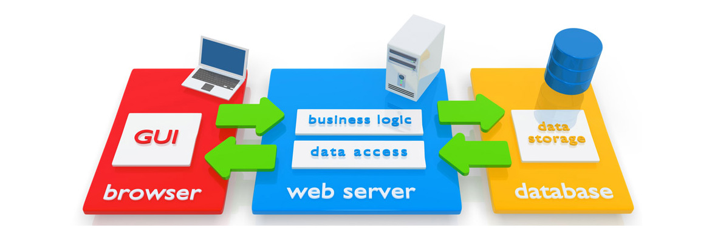
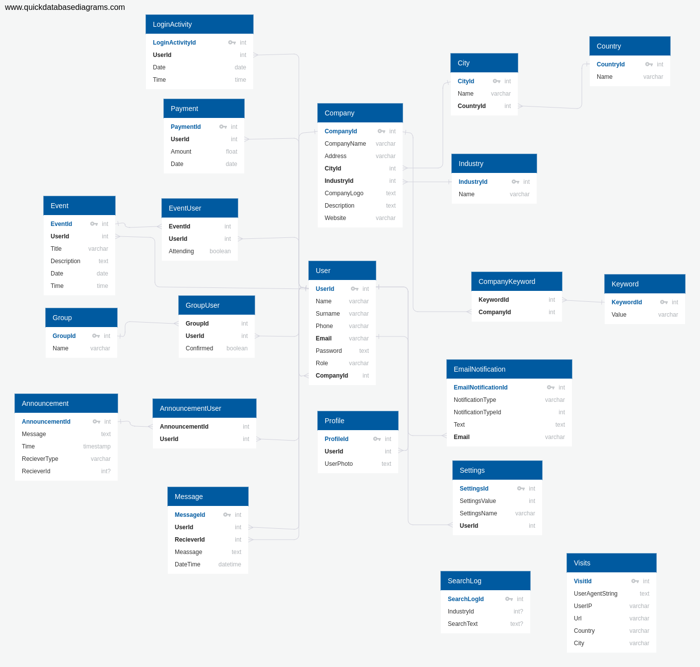
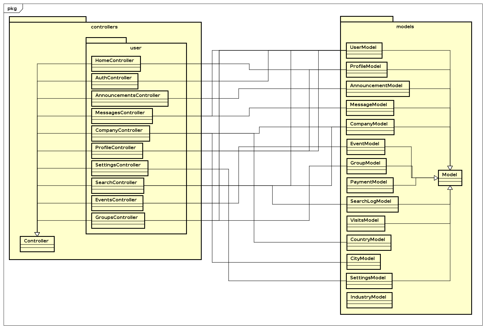
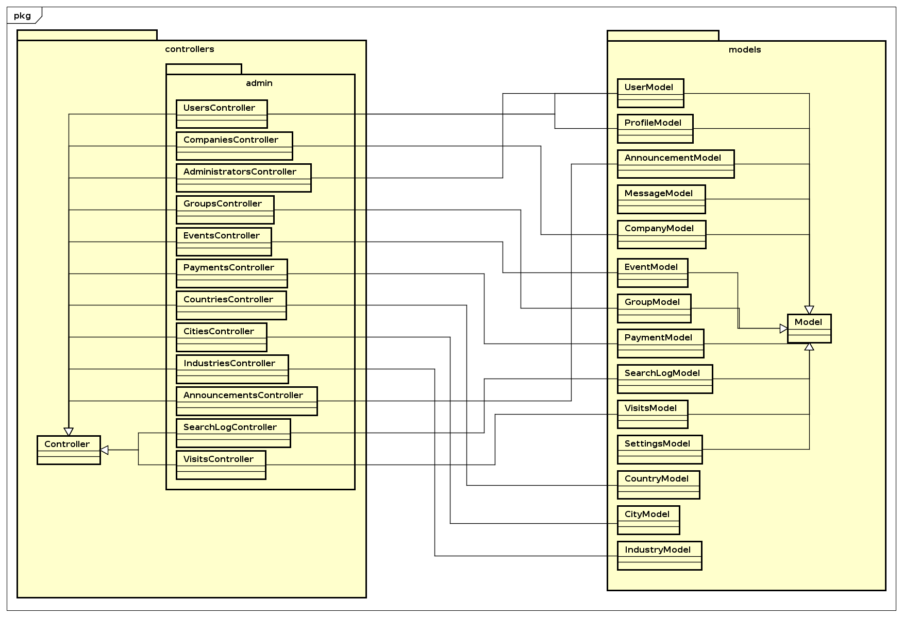
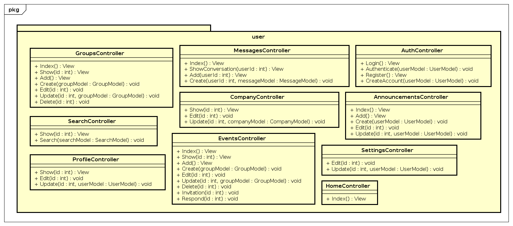
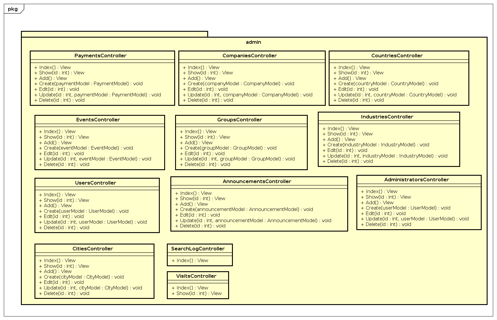
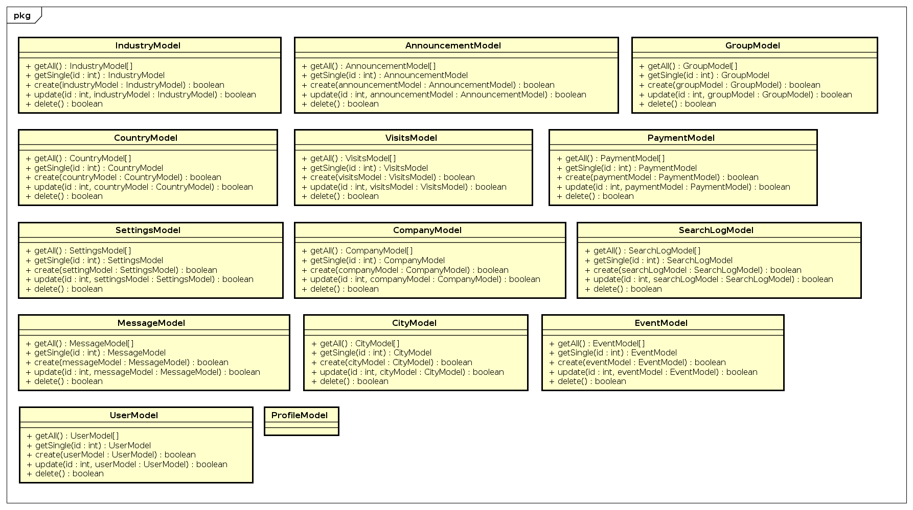
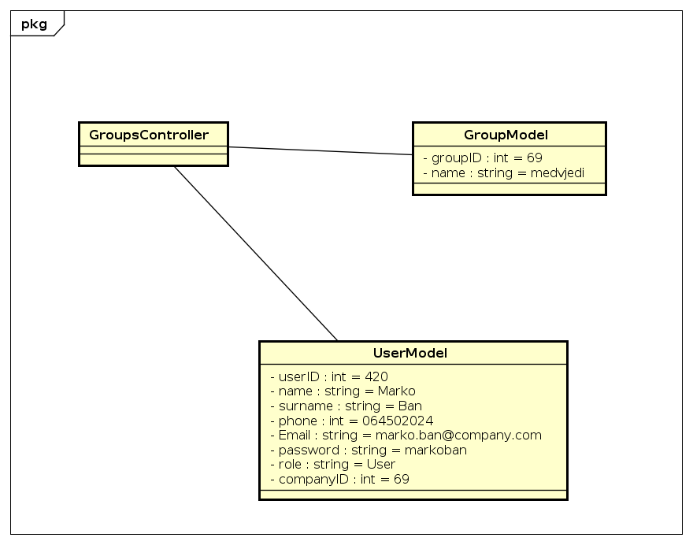

# 6. Arhitektura i dizajn sustava

## 6.1 Svrha, opći prioriteti i skica sustava

Arhitektura našeg sustava sastoji se od dva podsustava:

* Web aplikacija
* Baza podataka



### Web aplikacija

Kao programski jezik smo odabrali objektno orijentirani jezik C# te njegov
server-side web aplikacijski framework ASP.NET MVC Core. Za arhitekturu samog
sustava smo se odlučili slijediti MVC (Model-View-Controller) koncept koji je
nativno podržan od strane ASP.NET frameworka te uključuje već gotove predloške
koji uvelike olakšavaju i ubrzavaju razvoj web aplikacije.


### Baza podataka

Baza podataka je ključan dio, koji je potreban za dinamičnost podataka u cijelom
sustavu. U bazi će se kreirati relacije koje će olakšati dostupnost podataka
korisnicima te omogućiti ubrzano pretraživanje. Prilikom kreiranja baze podataka
isključena je mogućnost redundancije, podaci se mogu dodati u bazu podataka kada
god je god korisniku to potrebno i na isti način ih može i ukloniti. Da bi se
onemogućila redundantnost podataka, sve relacije i entiteti su uređeni na 3.
normalnu formu.



`dodati tumačenje baze podataka`

Entiteti baze podataka:

**User**

```
UserId PK int
Name varchar
Surname varchar
Phone varchar
Email varchar
Password text
Role varchar
CompanyId int FK >- Company.CompanyId
```

**Profile**

```
ProfileId PK int
UserId int FK >- User.UserId
UserPhoto text
```

**Company**

```
CompanyId PK int
CompanyName varchar
Address varchar
CityId int Fk >- City.CityID
IndustryId int FK >- Industry.IndustryId
CompanyLogo text
Description text
Website varchar
```

**City**

```
CityId PK int
Name varchar
CountryId int Fk >- Country.CountryID
```

**Country**

```
CountryId PK int
Name varchar
```

**Industry**

```
IndustryId int PK
Name varchar
```

**CompanyKeyword**

```
KeywordId int FK >- Keyword.KeywordId
CompanyId int FK >- Company.CompanyId
```

**Keyword**

```
KeywordId PK int
Value varchar
```

**AnnouncementUser**

```
AnnouncementId int FK >- Announcement.AnnouncementId
UserId int FK >- User.UserId
```

**Announcement**

```
AnnouncementId PK int
Message text
Time timestamp
RecieverType varchar
RecieverId int?
```

**Message**

```
MessageId int PK
UserId int FK >- User.UserId
RecieverId int FK >- User.UserId
Meassage text
DateTime datetime
```

**Group**

```
GroupId PK int
Name varchar
```

**EmailNotification**

```
EmailNotificationId PK int
NotificationType varchar
NotificationTypeId int
Text text
Email varchar FK >- User.Email
```

**Settings**

```
SettingsId int PK
SettingsValue int
SettingsName varchar
UserId int FK >- User.UserId
```

**GroupUser**

```
GroupId int FK >- Group.GroupId
UserId int FK >- User.UserId
Confirmed boolean
```

**Event**

```
EventId PK int
UserId int FK >- User.UserId
Title varchar
Description text
Date date
Time time
```

**EventUser**

```
EventId int FK >- Event.EventId
UserId int FK >- User.UserId
Attending boolean
```

**Payment**

```
PaymentId PK int
UserId int FK >- User.UserId
Amount float
Date date
```

**LoginActivity**

```
LoginActivityId PK int
UserId int FK >- User.UserId
Date date
Time time
```

**SearchLog**

```
SearchLogId PK int
IndustryId int?
SearchText text?
```

**Visits**

```
VisitId PK int
UserAgentString text
UserIP varchar
Url varchar
Country varchar
City varchar
```

## 6.2 Dijagram razreda s opisom




### Slika metoda Controllers sloja

Korisnički sloj:



Administratorski sloj:



### Slika metoda Models sloja



`dodati tumačenje zapisa controllers i models`

### Sloj Controller

Sloj Controller se dijeli dva sloja: korisnički i administratorski.

Korisnički sloj:

```c#
User\HomeController {
    // Prikaz pocetne neprijavljenim korisnicima
    Index ()
}
```

```c#
User\AuthController {
    // Prikaz forme za prijavu
    Login ()
    // Prijavljivanje unutar sustava
    Authenticate (UserModel model)

    // Prikaz forme za registraciju u kojem korisnik odabire postojecu ili stvara
    // novu tvrtku te unosi svoje osobne podatke
    Register ()
    // Stvaranje novog korisnickog racuna
    CreateAccount (UserModel model)
}
```

```c#
User\AnnouncementsController {
    // Prikaz svih obavijesti prijavljenom korisniku
    Index ()
    // Prikaz za dodavanje nove obavijesti
    Add ()
    // Dodavanje nove obavijesti
    Create (AnnouncementModel model)
    // Prikaz za uredjivanje obavijesti s identifikatorom 'id'
    Edit (int id)
    // Spremanje podataka obavijesti s identifikatorom 'id'
    Update (AnnouncementModel model, int id)
}
```

```c#
User\MessagesController {
    // Prikaz svih poruka prijavljenom korisniku
    Index ()
    // Prikaz poruka prijavljenom korisniku izmedu njega i korisnika s identifikatorom 'userId'
    ShowConversation (int userId)
    // Prikaz za dodavanje nove poruke
    Add ()
    // Dodavanje nove poruke
    Create (MessageModel model)
}
```

```c#
User\CompanyController {
    // Prikaz pojedinacne tvrtke s identifikatorom 'id'
    Show (int id)
    // Prikaz za uredivanje tvrtke prijavljenog korisnika
    Edit ()
    // Spremanje podataka tvrtke prijavljenog korisnika
    Update (CompanyModel model)
}
```

```c#
User\ProfileController {
    // Prikaz podataka korisnika s identifikatorom 'id'
    Show (int id)

    // Prikaz za uredivanje podataka prijavljenog korisnika
    Edit ()
    // Spremanje podataka prijavljenog korisnika
    Update (ProfileModel model)
}
```

```c#
User\SettingsController {
    // Prikaz za uredivanje postavki prijavljenog korisnika
    Edit ()
    // Spremanje postavki prijavljenog korisnika
    Update (ProfileModel model)
}
```

```c#
User\SearchController {
    // Prikaz za pretrazivanje
    Show ()
    // Prikaz rezultata prema ucinjenoj pretrazi
    Search (SearchModel model)
}
```

```c#
User\EventsController {
    // Prikaz svih sastanaka prijavljenom korisniku
    Index ()
    // Prikaz sastanaka s identifikatorom 'id'
    Show (int id)
    // Prikaz za dodavanje nove sastanka
    Add ()
    // Dodavanje novog sastanka
    Create (EventModel model)
    // Prikaz za uredjivanje sastanka s identifikatorom 'id'
    Edit (int id)
    // Spremanje podataka sastanka s identifikatorom 'id'
    Update (EventModel model, int id)
    // Brisanje sastanka s identifikatorom 'id'
    Delete (int id)
    // Prikaz pozivnice za sudjelovanje na sastanku s identifikatorom 'id'
    Invitation (int id)
    // Spremanje odgovora prijavljenog korisnika na pozivnicu za sastanak s identifikatorom 'id'
    Respond (int id)
}
```

```c#
User\GroupsController {
    // Prikaz svih grupa prijavljenom korisniku
    Index ()
    // Prikaz grupe s identifikatorom 'id'
    Show (int id)
    // Prikaz za dodavanje nove grupe
    Add ()
    // Dodavanje nove grupe
    Create (GroupModel model)
    // Prikaz za dodavanje novog sastanka    Create (GroupModel model)
    // Prikaz za uredjivanje grupe s identifikatorom 'id'
    Edit (int id)
    // Spremanje podataka grupe s identifikatorom 'id'
    Update (GroupModel model, int id)
    // Brisanje grupe s identifikatorom 'id'
    Delete (int id)
}
```

Administratorski sloj:

```c#
Admin\UsersController {
    // Prikaz svih korisnika
    Index ()
    // Prikaz korisnika s identifikatorom 'id' i njegovih aktivnosti koje dobivamo iz `LoginActivity` tablice
    Show (int id)
    // Prikaz za dodavanje novog korisnika
    Add ()
    // Dodavanje novog korisnika
    Create (UserModel model)
    // Prikaz za uredjivanje korisnika s identifikatorom 'id'
    Edit (int id)
    // Spremanje podataka korisnika s identifikatorom 'id'
    Update (UserModel model, int id)
    // Brisanje korisnika s identifikatorom 'id'
    Delete (int id)
}
```

```c#
Admin\CompaniesController {
    // Prikaz svih tvrtki
    Index ()
    // Prikaz za dodavanje nove tvrtke
    Add ()
    // Dodavanje nove tvrtke prema 'companyModel' podacima i kreiranje
    // prvog predstavnika prema 'userModel' podacima
    Create (CompanyModel companyModel, UserModel userModel)
    // Prikaz za uredjivanje tvrtki s identifikatorom 'id'
    Edit (int id)
    // Spremanje podataka tvrtki s identifikatorom 'id'
    Update (CompanyModel model, int id)
    // Brisanje tvrtki s identifikatorom 'id' i pripadnih predstavnka
    // iz baze podataka
    Delete (int id)
}
```

```c#
Admin\AdministratorsController {
    // Prikaz svih administratora
    Index ()
    // Prikaz administratora s identifikatorom 'id'
    Show (int id)
    // Prikaz za dodavanje novog administratora
    Add ()
    // Dodavanje novog administratora
    Create (GroupModel model)
    // Prikaz za uredjivanje administratora s identifikatorom 'id'
    Edit (int id)
    // Spremanje podataka administratora s identifikatorom 'id'
    Update (GroupModel model, int id)
    // Brisanje administratora s identifikatorom 'id'
    Delete (int id)
}
```

```c#
Admin\GroupsController {
    // Prikaz svih grupa
    Index ()
    // Prikaz za dodavanje nove grupe
    Add ()
    // Dodavanje nove grupe
    Create (GroupModel model)
    // Prikaz za uredjivanje grupe s identifikatorom 'id'
    Edit (int id)
    // Spremanje podataka grupe s identifikatorom 'id'
    Update (GroupModel model, int id)
    // Brisanje grupe s identifikatorom 'id'
    Delete (int id)
}
```

```c#
Admin\EventsController {
    // Prikaz svih sastanaka
    Index ()
    // Prikaz za dodavanje novog sastanka
    Add ()
    // Dodavanje novog sastanka
    Create (EventModel model)
    // Prikaz za uredjivanje sastanka s identifikatorom 'id'
    Edit (int id)
    // Spremanje podataka sastanka s identifikatorom 'id'
    Update (EventModel model, int id)
    // Brisanje sastanka s identifikatorom 'id'
    Delete (int id)
}
```

```c#
Admin\PaymentsController {
    // Prikaz svih uplata
    Index ()
    // Prikaz uplate s identifikatorom 'id'
    Show (int id)
    // Prikaz za dodavanje nove uplate
    Add ()
    // Dodavanje nove uplate
    Create (PaymentModel model)
    // Prikaz za uredjivanje uplate s identifikatorom 'id'
    Edit (int id)
    // Spremanje podataka uplate s identifikatorom 'id'
    Update (PaymentModel model, int id)
    // Brisanje uplate s identifikatorom 'id'
    Delete (int id)
}
```

```c#
Admin\CountriesController {
    // Prikaz svih drzava
    Index ()
    // Prikaz za dodavanje nove drzave
    Add ()
    // Dodavanje nove drzave
    Create (CountryModel model)
    // Prikaz za uredjivanje drzave s identifikatorom 'id'
    Edit (int id)
    // Spremanje podataka drzave s identifikatorom 'id'
    Update (CountryModel model, int id)
    // Brisanje drzave s identifikatorom 'id'
    Delete (int id)
}
```

```c#
Admin\CitiesController {
    // Prikaz svih gradova
    Index ()
    // Prikaz za dodavanje novog grada
    Add ()
    // Dodavanje novog grada
    Create (PaymentModel model)
    // Prikaz za uredjivanje grada s identifikatorom 'id'
    Edit (int id)
    // Spremanje podataka grada s identifikatorom 'id'
    Update (PaymentModel model, int id)
    // Brisanje grada s identifikatorom 'id'
    Delete (int id)
}
```

```c#
Admin\IndustriesController {
    // Prikaz svih djelatnosti
    Index ()
    // Prikaz za dodavanje nove djelatnosti
    Add ()
    // Dodavanje nove djelatnosti
    Create (PaymentModel model)
    // Prikaz za uredjivanje djelatnosti s identifikatorom 'id'
    Edit (int id)
    // Spremanje podataka djelatnosti s identifikatorom 'id'
    Update (PaymentModel model, int id)
    // Brisanje djelatnosti s identifikatorom 'id'
    Delete (int id)
}
```

```c#
Admin\AnnouncementsController {
    // Prikaz svih obavijesti
    Index ()
    // Prikaz za dodavanje nove obavijesti
    Add ()
    // Dodavanje nove obavijesti
    Create (AnnouncementModel model)
    // Prikaz za uredjivanje obavijesti s identifikatorom 'id'
    Edit (int id)
    // Spremanje podataka obavijesti s identifikatorom 'id'
    Update (AnnouncementModel model, int id)
    // Brisanje obavijesti s identifikatorom 'id'
    Delete (int id)
}
```

```c#
Admin\SearchLogController {
    // Prikaz svih upita koje su korisnici za pretazivanje
    Index ()
}
```

```c#
Admin\VisitsController {
    // Prikaz svih posjeta korisnika
    Index ()
    // Prikaz detalja pojedinog posjeta s identifikatorom 'id'
    Show (int id)
}
```

### Sloj Model

`tumačenje sloja model`

```c#
UserModel {
  // Dohvaca listu svih dostupnih objekata u bazi podataka
  getAll()
  // Dohvaca pojedinacni objekt s identifikatorom 'id' iz baze podataka
  // ukoliko postoji relacija 'User' -> 'Profile' dohvaca i 'Profile' objekt
  // u sklopu 'User' objekta
  getSingle(int id)
  // Stvara novi objekt prema primljenim podacima u 'data' parametru
  // ukoliko je predan parametar 'profileData' stvara se 'Profile'
  // objekt i relacija 'User' -> 'Profile'
  create(UserModel data, ProfileModel profileData)
  // Sprema izmjene objekta s identifikatorom 'id' prema podacima u 'data' parametru
  update(int id, UserModel data)
  // Brise objekt s identifikatorom 'id' iz baze podataka
  delete(int id)
}
```

```c#
ProfileModel {
  // model je napisan radi kompletnosti dokumentacije - nikada ne radimo s 'Profile'
  // direktno vec uvijek posredno putem 'User' objekta
}
```

```c#
AnnouncementModel {
  // Dohvaca listu svih dostupnih objekata u bazi podataka
  getAll()
  // Dohvaca pojedinacni objekt s identifikatorom 'id' iz baze podataka
  getSingle(int id)
  // Stvara novi objekt prema primljenim podacima u 'data' parametru
  create(AnnouncementModel data)
  // Sprema izmjene objekta s identifikatorom 'id' prema podacima u 'data' parametru
  update(int id, AnnouncementModel data)
  // Brise objekt s identifikatorom 'id' iz baze podataka
  delete(int id)
}
```

```c#
MessageModel {
  // Dohvaca listu svih dostupnih objekata u bazi podataka
  getAll()
  // Dohvaca pojedinacni objekt s identifikatorom 'id' iz baze podataka
  getSingle(int id)
  // Stvara novi objekt prema primljenim podacima u 'data' parametru
  create(MessageModel data)
  // Sprema izmjene objekta s identifikatorom 'id' prema podacima u 'data' parametru
  update(int id, MessageModel data)
  // Brise objekt s identifikatorom 'id' iz baze podataka
  delete(int id)
}
```

```c#
CompanyModel {
  // Dohvaca listu svih dostupnih objekata u bazi podataka
  getAll()
  // Dohvaca pojedinacni objekt s identifikatorom 'id' iz baze podataka
  getSingle(int id)
  // Stvara novi objekt prema primljenim podacima u 'data' parametru
  create(CompanyModel data)
  // Sprema izmjene objekta s identifikatorom 'id' prema podacima u 'data' parametru
  update(int id, CompanyModel data)
  // Brise objekt s identifikatorom 'id' iz baze podataka
  delete(int id)
}
```

```c#
EventModel {
  // Dohvaca listu svih dostupnih objekata u bazi podataka
  getAll()
  // Dohvaca pojedinacni objekt s identifikatorom 'id' iz baze podataka
  getSingle(int id)
  // Stvara novi objekt prema primljenim podacima u 'data' parametru
  create(EventModel data)
  // Sprema izmjene objekta s identifikatorom 'id' prema podacima u 'data' parametru
  update(int id, EventModel data)
  // Brise objekt s identifikatorom 'id' iz baze podataka
  delete(int id)
}
```

```c#
GroupModel {
  // Dohvaca listu svih dostupnih objekata u bazi podataka
  getAll()
  // Dohvaca pojedinacni objekt s identifikatorom 'id' iz baze podataka
  getSingle(int id)
  // Stvara novi objekt prema primljenim podacima u 'data' parametru
  create(GroupModel data)
  // Sprema izmjene objekta s identifikatorom 'id' prema podacima u 'data' parametru
  update(int id, GroupModel data)
  // Brise objekt s identifikatorom 'id' iz baze podataka
  delete(int id)
}
```

```c#
PaymentModel {
  // Dohvaca listu svih dostupnih objekata u bazi podataka
  getAll()
  // Dohvaca pojedinacni objekt s identifikatorom 'id' iz baze podataka
  getSingle(int id)
  // Stvara novi objekt prema primljenim podacima u 'data' parametru
  create(PaymentModel data)
  // Sprema izmjene objekta s identifikatorom 'id' prema podacima u 'data' parametru
  update(int id, PaymentModel data)
  // Brise objekt s identifikatorom 'id' iz baze podataka
  delete(int id)
}
```

```c#
SearchLogModel {
  // Dohvaca listu svih dostupnih objekata u bazi podataka
  getAll()
  // Dohvaca pojedinacni objekt s identifikatorom 'id' iz baze podataka
  getSingle(int id)
  // Stvara novi objekt prema primljenim podacima u 'data' parametru
  create(SearchLogModel data)
  // Sprema izmjene objekta s identifikatorom 'id' prema podacima u 'data' parametru
  update(int id, SearchLogModel data)
  // Brise objekt s identifikatorom 'id' iz baze podataka
  delete(int id)
}
```

```c#
VisitsModel {
  // Dohvaca listu svih dostupnih objekata u bazi podataka
  getAll()
  // Dohvaca pojedinacni objekt s identifikatorom 'id' iz baze podataka
  getSingle(int id)
  // Stvara novi objekt prema primljenim podacima u 'data' parametru
  create(VisitsModel data)
  // Sprema izmjene objekta s identifikatorom 'id' prema podacima u 'data' parametru
  update(int id, VisitsModel data)
  // Brise objekt s identifikatorom 'id' iz baze podataka
  delete(int id)
}
```

```c#
SettingsModel {
  // Dohvaca listu svih dostupnih objekata u bazi podataka
  getAll()
  // Dohvaca pojedinacni objekt s identifikatorom 'id' iz baze podataka
  getSingle(int id)
  // Stvara novi objekt prema primljenim podacima u 'data' parametru
  create(SettingsModel data)
  // Sprema izmjene objekta s identifikatorom 'id' prema podacima u 'data' parametru
  update(int id, SettingsModel data)
  // Brise objekt s identifikatorom 'id' iz baze podataka
  delete(int id)
}
```

```c#
CountryModel {
  // Dohvaca listu svih dostupnih objekata u bazi podataka
  getAll()
  // Dohvaca pojedinacni objekt s identifikatorom 'id' iz baze podataka
  getSingle(int id)
  // Stvara novi objekt prema primljenim podacima u 'data' parametru
  create(CountryModel data)
  // Sprema izmjene objekta s identifikatorom 'id' prema podacima u 'data' parametru
  update(int id, CountryModel data)
  // Brise objekt s identifikatorom 'id' iz baze podataka
  delete(int id)
}
```

```c#
CityModel {
  // Dohvaca listu svih dostupnih objekata u bazi podataka
  getAll()
  // Dohvaca pojedinacni objekt s identifikatorom 'id' iz baze podataka
  getSingle(int id)
  // Stvara novi objekt prema primljenim podacima u 'data' parametru
  create(CityModel data)
  // Sprema izmjene objekta s identifikatorom 'id' prema podacima u 'data' parametru
  update(int id, CityModel data)
  // Brise objekt s identifikatorom 'id' iz baze podataka
  delete(int id)
}
```

```c#
IndustryModel {
  // Dohvaca listu svih dostupnih objekata u bazi podataka
  getAll()
  // Dohvaca pojedinacni objekt s identifikatorom 'id' iz baze podataka
  getSingle(int id)
  // Stvara novi objekt prema primljenim podacima u 'data' parametru
  create(IndustryModel data)
  // Sprema izmjene objekta s identifikatorom 'id' prema podacima u 'data' parametru
  update(int id, IndustryModel data)
  // Brise objekt s identifikatorom 'id' iz baze podataka
  delete(int id)
}
```

## 6.3 Dijagram objekata


